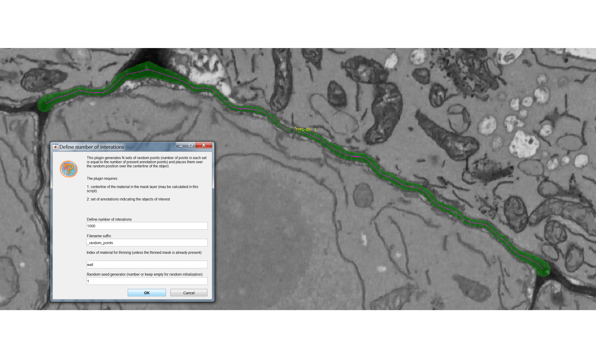

<!-- Load Zooming library -->
<script src="https://unpkg.com/zooming/build/zooming.min.js"></script>

<script>
// Listen to images after DOM content is fully loaded
document.addEventListener('DOMContentLoaded', function () {
new Zooming({
// options...
}).listen('.img-zoomable')
})
</script>

<br>

In this section we are now going to use the first plugin we developed for the Paterlini, Belevich et al. paper: the *SpatialControlPoints* plugin. The biological question we will try to address with this tool relates to the distribution of Plasmodesmata (or similar types of annotations along a given model). We start by asking: **are plasmodesmata spread homogeneously across the cell wall?**

<br>

# Run the *SpatialControlPoints* plugin {#run} 

<br>

In order to ask questions relating to the distributions of actual PD, a comparable simulated distribution had to be generated. Such distribution differs from the real PD one in that the points are placed over the same surface midline but sampling them from a uniform distribution. The *SpatialControlPoints* performs such function. Please see methods section of the paper for more detail.

Make sure you have loaded your datasets, models and annotations as described in in the [Preliminary Steps section](preliminary.html).  

From the MIB interface go to the *Plugins* tab -> *Plasmodesmata* -> *SpatialControlPoints*. 

A user interface will appear with four fields to be filled in: 

  * "Define number of interactions" defines the number of spatial simulations the plugin will generate. Each simulation has a number of points equal to that of the real plasmodesmata on the interface of interest. The points in the simulations have a uniform distribution.
  * "The filename suffix" defines the ending of the name of the file that will be generated by the plugin.
  * "The index of material for thinning" refers to which material in your *.model* file contains the segmented surface of interest. In the case of the sample datasets this is *wall*. This section is equivalent to the *Thin and remove branches* button within the pre-processing box of the CellWallThickness plugin in the [Cell Wall section](wall.html). The function in both plugins generates a midline of the model (in presence of branching points, keeps the longest branch) and temporarily stores it in the Mask layer of the *.model* file. For more details please see the paper. 
  * "The random seed generator" enables to reproduce results (generating the same control distributions for that particular model). The same seed generator number needs to be used for such purpose. Every time you will run the plugin - on the same dataset - with that number you will obtain the same control points.

You should ultimately see something like the following, where a pink midline has appeared:

<!-- all figures need to be placed in this syntax to be zoomable -->

<figure></figure>


# Extract real positions

<br>
In addition to the spatial controls we generated [above](#run) we also need to extract the actual positions of our Plasmodesmata (or points of interest), in order to compare the two. Their coordinates are already contained in the *.ann* files but we need to export them in a more machine readable format, more suitable for data processing.

Open the *Annotation List* (bottom left corner after selecting *Annotations* from the scroll down menu), press *Save* and save them as *.csv* files.

The coordinates of the points are recalculated relative to the bounding box of the image. The same operation was also performed by the plugin after generating the control points.

<br>

# Check outputs 

<br>

If the plugin has worked correctly and you followed the instructions to export the coordinates of your real points your *Data_individual_cells* folder should now contain three additional files. 

Two are the output of the *SpatialControlPoints* plugin: a <i>\*_random_points.csv</i> and a <i>\*_random_points.mat</i>. Both files contain the same data but in two different formats. People confident with Matlab are more than welcome to use that format, here we will proceed with the *.csv* format.

The fird file is a <i>\*_Ann.csv</i> file that contains the coordinates of the real points.

<br>
<figure></figure>

<br>

If you want to analyse multiple datasets at the same, as we will do here, the processes described above need to be repeated for each *.am* file.

<br>

# Moving to R

<br>

We have now generated the data necessary for our analyses so we will move away from the MIB environment and process the data in R. 

<br>

# Reading the files

<br>

```{r, include= FALSE}

# THIS SECTION IS HIDDEN AND ONLY REQUIRED FOR KNITTING PURPOSES
# BECAUSE WE DON'T WANT TO SHOW SETWD FUNCTION (as the path would likely be different on the computer of a user, we mirror the first part of the script and run it in a hidden chunk. The chunk diplayed will actally be idle, showing the code but not run

library(tidyverse)

setwd('./Data_individual_cells')

Col_simul <- list.files(path = ".", pattern = "random_points.csv") %>% 
  map_df(function(f){
    print(f) 
    x <- read_csv(f) %>% 
      as.data.frame %>% 
      mutate(Genotype = "Col-0") %>%
      mutate(Interface = "PPP-EN") 
  })    

Col_real <- list.files(path = ".", pattern = "Ann.csv") %>% 
  map_df(function(f){
    print(f) 
    x <- read_csv(f) %>% 
      as.data.frame %>% 
      select(c(LabelPositionXunits, LabelPositionYunits, LabelPositionZunits)) %>% 
      rename("X_units"="LabelPositionXunits") %>%
      rename("Y_units"="LabelPositionYunits") %>%
      rename("Z_units"="LabelPositionZunits") %>%
      mutate(Genotype = "Col-0") %>%
      mutate(DatasetFilename = f) %>%
      mutate(Interface = "PPP-EN") %>%
      mutate(IterationNumber = "real")
  })    

# we also set the general plotting theme so that we don't need to make it explicit in the other chunks
# where we need to deviate from this it is shown in the code

theme_set(
  theme_bw() + 
      theme(axis.title.x = element_text(size = 15), 
        axis.title.y = element_text(size = 15), 
        axis.text.x = element_text(size = 15), 
        axis.text.y = element_text(size = 15),
        strip.text.x = element_text(size = 15), 
        legend.title = element_text(size = 15),
        legend.text = element_text(size = 15))  
)

```

```{r, eval = FALSE}

library(tidyverse)

# IMPORTANT:
# the working directory is assumed to be the downloaded folder "Data_individual_cells" so paths are given relative to that. Make sure this is also the case in your R environment using the getwd and setwd

### READING THE FILES CONTAINING THE OUTPUT OF THE SPATIALCONTROLPOINTS PLUGIN ###

# the following function will read all the "random_points" files in the folder you assigned as your working directory
# using the mutate function then we add extra informations such as genotype and the interface we are analysing
# a new large dataset will be created

Col_simul <- list.files(path = ".", pattern = "random_points.csv") %>% 
  map_df(function(f){
        #this will print the dataset 
    print(f) 
    x <- read_csv(f) %>% 
      as.data.frame %>% 
      mutate(Genotype = "Col-0") %>%
      mutate(Interface = "PPP-EN") 
  })    

### READING THE FILES CONTAINING THE EXPORTED REAL ANNOTATIONS ###

#the same code as above will also work to read the files containing the real PD positions do but we need to add a couple of extra lines due to the way the file was written by MIB programme

Col_real <- list.files(path = ".", pattern = "Ann.csv") %>% 
  map_df(function(f){
    print(f) 
    x <- read_csv(f) %>% 
      as.data.frame %>% 
      # we need to select only the columns where the coordinates were recalculated relative to the bounding box
      select(c(LabelPositionXunits, LabelPositionYunits, LabelPositionZunits)) %>% 
      # for compatibility with the Col_simulated we need to have the same labels on the columns
      rename("X_units"="LabelPositionXunits") %>%
      rename("Y_units"="LabelPositionYunits") %>%
      rename("Z_units"="LabelPositionZunits") %>%
      mutate(Genotype = "Col-0") %>%
      #the following line attaches the file name as the DatasetFilename
      mutate(DatasetFilename = f) %>%
      mutate(Interface = "PPP-EN") %>%
      # we add a fake column for iteration - this is important to be able to merge this object with Col_simul
      mutate(IterationNumber = "real")
  })    

```


```{r, message = FALSE, warning= FALSE, results = 'hide'}

### MERGING THE TWO OBJECTS ###

# Before merging we need to clean the name of the files, removing the original file format and other endings added during the data generation by the plugins. 
# It is important that the Datsetfilenames in the Col_simul and Col_real objects are the same before we merge them. Comparisons won't be otherwise possible

Col_simul$DatasetFilename <- gsub(".am", "", Col_simul$DatasetFilename)
Col_real$DatasetFilename <- gsub("_Ann.csv", "", Col_real$DatasetFilename)

#now we are going to merge the two files
Col_0 <- rbind(Col_real, Col_simul)

#we are now going to separate the daset file name in two columns, one containing info on the root and one containing info on the actual cell

# we are going to duplicate the dataset column first
Col_0$Cell = Col_0$DatasetFilename

# in the column cell we remove anything before the name of the cell
Col_0$Cell <- gsub(".*PPP", "PPP", Col_0$Cell)

#in the dataset filename column we remove anything after _DNN
Col_0$DatasetFilename <- gsub("_PPP.*","", Col_0$DatasetFilename)

```

<br>

# 3D visualisations

<br>

```{r, message = FALSE, warning= FALSE}

#you will need this library for plotting
library("scatterplot3d")  

#we are going to look at one single cell so we will filter the Col_0 object
Col_0_subset <- filter(Col_0, DatasetFilename == "170314_Col_HD_R20_339-381um_DNN" & Cell == "PPP1-ENa")

# now we are going to separate the real coordinates
real_example <- filter(Col_0_subset, IterationNumber == "real")
# and one of the simulations
simulation_example <- filter(Col_0_subset, IterationNumber == "1")

# we need to retain just the columns containing x, y, z coordinates
real_example <- real_example[,c('X_units','Y_units', 'Z_units')]
simulation_example <- simulation_example[,c('X_units','Y_units', 'Z_units')]

# for plotting we need an extra function to add grids
# you will need an internet connection
source('http://www.sthda.com/sthda/RDoc/functions/addgrids3d.r')

# this line creates the space for two images side by side
par(mfrow=c(1, 2))

# we create the environment
s3d <- scatterplot3d(real_example, main = "Real distribution", 
              xlab = "x",
              ylab = "y",
              zlab = "z", pch = "", type = "h", color="burlywood2", grid=FALSE, box=FALSE, lty.hplot=3)

#we add grids
addgrids3d(real_example, grid = c("xy", "xz", "yz"))

#now we add the points in
s3d$points3d(real_example, pch = 16, col="firebrick1")

#the same is repeated for the simulated data

s3d <-scatterplot3d(simulation_example, main= "Simulated distribution", 
              xlab = "x",
              ylab = "y",
              zlab = "z", pch = "", type = "h", color="khaki2", grid=FALSE, box=FALSE, lty.hplot=3)  

addgrids3d(simulation_example, grid = c("xy", "xz", "yz"))

s3d$points3d(simulation_example, pch = 16, col="gold3")

```


# Euclidean distances calculations and plotting

<br>

```{r}

# the following line nests the 3 columns corresponding to the x,y,z coordinates into a new column called "coordinates"
Col_0_nested <- Col_0 %>% 
  group_by(DatasetFilename, Cell, Genotype, Interface, IterationNumber) %>% 
  nest(.key="coordinates") 
#the command can take a while

# the next function calculates a matrix of the coordinates and then euclidean distances between all points

matrixdist <- function(my_df) {
 matrix <- as.matrix(my_df) 
 distance <- dist(matrix,  method = "euclidean")
 # return a numeric vector instead of distance matrix
 as.numeric(distance)
}

#we create a new column for the distances (that will be calculated with the function above)
#There is a map function in other packages we are using so we make it explicit without loading library

Col_0_nested <- Col_0_nested %>%
  mutate(distances = map(coordinates, matrixdist)) %>% 
  # this is a handy trick for later colouring purposes, you generate a coloumn with a binary classification using ifelse. All those that are not real are simulated
  mutate(Type = ifelse(IterationNumber == "real", "Real points", "Simulated"))

#for graphical purposes we reduce the number of iterations that will be plotted on the graph to 100 (rather than the available 1000). This is done just to speed things up

Col_0_nested %>% 
  filter(IterationNumber %in% c(1:100, "real")) %>% 
  unnest(distances) %>% 
  ggplot(aes(distances, group = IterationNumber, colour = Type)) +
  geom_density() + facet_wrap(~DatasetFilename) + theme_bw() + 
  #geom_hline is just a trick to make the lines "float" rather than have a base bar
  geom_hline(yintercept=0, colour="white", size=0.5) +
  theme(legend.position=c(0.85, 0.1)) +
  labs(x = "Pairwise euclidean distances between PDs", y = "Frequency of occurrence") + 
  theme(axis.title.x = element_text(size = 12), 
        axis.title.y = element_text(size = 12), 
        axis.text.x = element_text(size = 12), 
        axis.text.y = element_text(size = 12),
        strip.text.x = element_text(size = 6),
        legend.text=element_text(size=12),
        legend.title = element_text(size=12)) +
  facet_wrap(DatasetFilename~Cell)

# just focusing on a single cell
# we filter and unnest the object
Col_0_subset <- Col_0_nested %>%
  filter(DatasetFilename == "170314_Col_HD_R20_339-381um_DNN" & Cell == "PPP1-ENa") %>% unnest(distances)

Col_0_subset %>% 
  # here we annotated out the filtering of iteration so it takes longer
  #filter(IterationNumber %in% c(1:100, "real")) %>% 
  ggplot(aes(distances, group = IterationNumber, colour = Type)) +
  geom_density() + 
  # to make the line of the real points stand out we use a trick and make it wider
  geom_density(data= filter(Col_0_subset, Type == "Real points"), aes(distances), size = 2) + 
  geom_hline(yintercept=0, colour="white", size=2) +
  labs(x = "Pairwise euclidean distances between PDs", y = "Frequency of occurrence") +
  scale_color_manual(values=c("firebrick1", "gold2")) 
  
```

<br>

# KS tests and plotting of cell values

<br>

```{r, message = FALSE, warning= FALSE}

#library(broom) called in the function so no need to load it

# to perform the next section we actually need to structure the data in a slighly different manner. Rather than editing the Col_0 objects we generated we go back to the Col_real and Col_simul objects in the first section

# we generate again the distances, this time separately for real and simul

Col_real_dists <- Col_real %>% 
  group_by(DatasetFilename) %>% 
  summarise(dist_real = list(as.numeric(dist(cbind(X_units, Y_units, Z_units)))))

Col_simul_dists <-  Col_simul %>% 
  group_by(DatasetFilename, IterationNumber) %>% 
  summarise(dist_sim = list(as.numeric(dist(cbind(X_units, Y_units, Z_units)))))

# we merge the two in a way that the real_dist data gets repeated for each one of the simul_dist

Col_0_dists <- full_join(Col_real_dists, Col_simul_dists, by = c("DatasetFilename")) %>%
  mutate(Interface = "PPP-EN") %>%
  mutate(Genotype  = "Col-0")

# we create a function to perforn a pairwise ks test and clean its output

tidy_ks <- function(x, y){
  ks.test(x, y) %>% broom::tidy()
}

# we store the output of the function in a new column

Col_0_dists <- Col_0_dists %>%
  mutate(ks = map2(dist_real, dist_sim, tidy_ks)) %>% 
  unnest(ks)

# we can already assess the significance of the results based on the p values 

# now we look at the distribution of p values

Col_0_dists %>%
  ggplot(aes(p.value, group=DatasetFilename, fill=Interface, colour=Interface)) + 
  theme_bw() +
  geom_density(size = 1, alpha = 0.3) +
  theme(legend.position = "bottom") +
  geom_vline(xintercept=0.05, colour="red", size=0.80) + 
  labs(x = "p.value", y = "Density") +
  theme(axis.title.x = element_text(size = 15), 
        axis.title.y = element_text(size = 15), 
        axis.text.x = element_text(size = 15), 
        axis.text.y = element_text(size = 15),
        strip.text.x = element_text(size = 15), 
        strip.text.y = element_text(size = 15),
        legend.title = element_text(size = 10),
        legend.text = element_text(size = 10)) +
  # we use a log scale to better visualise the values 
  scale_x_log10() +
  facet_grid(Genotype~.)

# we can then look at variation between cells of the same genotype

Col_0_dists %>% 
  ggplot(aes(statistic, colour = DatasetFilename, fill= DatasetFilename)) +
  geom_density(size = 1, alpha = 0.5) +
  theme(legend.position = "bottom") +
  # we colour 0 as this is the value in the test results that would mean identity between the two distributions tested
  geom_vline(xintercept=0, colour="red", size=0.80) +
  scale_x_continuous(limits = c(0, 0.35)) +
  # to split the legend over 2 columns we use the guides argument
  guides(colour = guide_legend(ncol = 2)) + 
  labs(x = "Ks statistic test value", y = "Density") +
  theme(legend.title = element_text(size = 10),
        legend.text = element_text(size = 10)) +
  facet_grid(Genotype~Interface) 

```
<br>

# KS values for genotype(s)

<br>

```{r, message = FALSE, warning= FALSE}

#library(dplyr) called in the function so no need to load it

# please note that here we have data for a single genotype (the sample data provided belong to WT roots) so the visualisation might appear less useful compared to what we had in the paper

# summarising the test outputs per cell and per genotype 

distances_cell <- Col_0_dists %>% group_by(Genotype, Interface, DatasetFilename) %>% 
  dplyr::summarise(mean_ks = mean(statistic, na.rm = TRUE), 
                   mean_p = mean(p.value, na.rm = TRUE))

#check again statistics
non_signif <- filter(distances_cell, mean_p > 0.05)
# 0

#we are now going to separate the dataset file name in two columns, one containing info on the root and one containing info on the actual cell
# we are going to duplicate the dataset column first
distances_cell$Cell = distances_cell$DatasetFilename

#in the dataset filename column we remove anything after _DNN
distances_cell$DatasetFilename <- gsub("_PPP.*","", distances_cell$DatasetFilename)

# in the column cell we remove anything before the name of the cell
distances_cell$Cell <- gsub(".*PPP", "PPP", distances_cell$Cell)

# we are now going to plot the data for all the cells (violin plots) and for single cells (symbols) at the same time. Bars of corresponding colours will indicate medians

distances_cell %>% 
  ggplot(aes(x= Genotype, y=mean_ks, colour= Genotype, fill= Genotype)) + 
  # we plot the values for the single cells
  ggbeeswarm::geom_quasirandom(aes(shape=DatasetFilename), width = 0.2, size= 4, alpha=0.5, dodge.width = 0.2, show.legend = FALSE) +
  stat_summary(fun.y = median, fun.ymin = median, fun.ymax = median,
               geom = "crossbar", size = 0.5, width = 0.3, alpha=1) + 
  geom_hline(yintercept=0, colour="red", size=0.75) + 
  labs(y = "Ks statistic test value") +
  theme(legend.position = "none") +
  # we have 2 different roots or datsets here so we provide two symbols to differenciate them
  scale_shape_manual(values=c(19, 17)) +
  scale_y_continuous(limits = c(0, 0.3)) +
  # we have one single genotype here
  scale_color_manual(values=c("#8B8B83")) +
  scale_fill_manual(values=c("#8B8B83")) +
  facet_grid(~Interface)


```
<br>

# Sampling of the datasets

<br>


```{r, message = FALSE, warning= FALSE}

# to replicare what we did in the paper (manipulatig the nuber of points to test the robustness of the outcome) there is a convenient function in R 
# take the Col objects 
# use the sample_n to randomly take a subset of the given ones. Size corresponds to the number of points we sample.Here are 37 

real_subset <- Col_real %>% group_by(Genotype, Interface, DatasetFilename, IterationNumber) %>%
  sample_n(size=37)

simulated_subset <- Col_simul %>% group_by(Genotype, Interface, DatasetFilename, IterationNumber) %>%
  sample_n(size=37)


```


<br>

You have now completed this section: in the case of the data we provided we have shown that plasmodesmata display a bias in their distribution (when compared to uniform distributions). In the [next section](clusters.html) we will ask further questions about the this spatial bias we detected.

<br>
