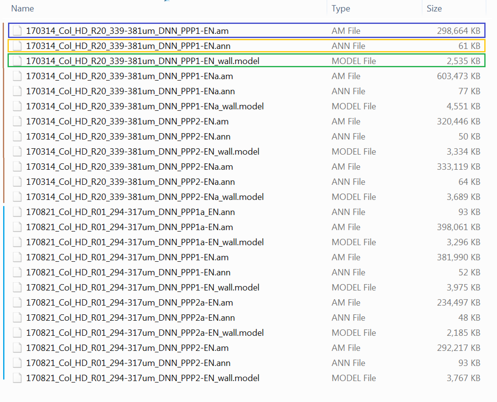
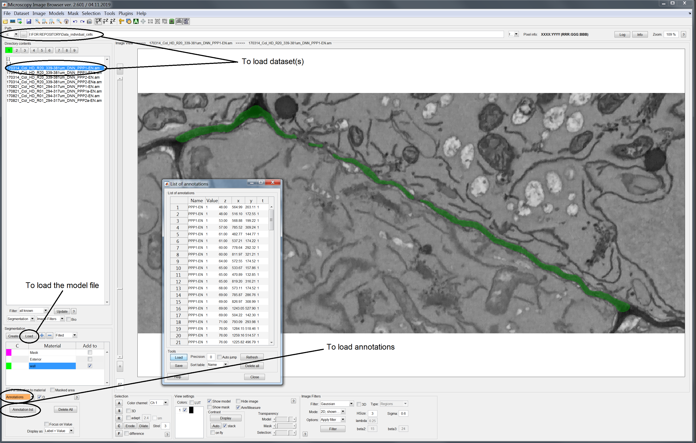

<!-- Load Zooming library -->
<script src="https://unpkg.com/zooming/build/zooming.min.js"></script>

<script>
// Listen to images after DOM content is fully loaded
document.addEventListener('DOMContentLoaded', function () {
new Zooming({
// options...
}).listen('.img-zoomable')
})
</script>


<br>

In this document we offer the opportunity to test the pipeline on some sample data before applying it to your own data. You don't have to download the data if don't feel like it, you can also just follow the text.

<br>

# Download the data 

<br>

We have uploaded **Example datasets** to the Google drive (they will be moved to a proper data repository before final submission). Please download the folder from [here](https://drive.google.com/file/d/1g-Wg7AuJTwVdNdB3ydkkET8hvQtFOPC0/view?usp=sharing) and store it on your computer. [(/these will be moved to an official data repository before final publication)](actual link). Unzip the *Data_individual_cells* folder and don't rename it as we will use it as the working directory. In the case of your own data you can have a name different from for your folder. However, bear in mind that you might need to adjust the scripts provided in this pipeline accordingly. 

<br>

# Open the data {#open} 

<br>

In the unzipped folder you will find a series of files of different types. Here is a snapshot image showing them

<br>

<figure></figure>


{width="750"}


In the folder there are datasets from 2 different Col-0 samples (WT *Arabidopsis thaliana* roots). The data associated with each sample are shown with the vertical brown and light blue bars in the image. For each of these two samples, multiple cells are provided. Each cell dataset has 3 files associated with it to start with (more will be generated as we go along the pipeline).

You should see a *.am* file (blue box), which contains the image stack itself (and is indeed the heaviest file), a *.model* file (green box) which contains the cell wall model (this has already been generated, in the case of your own data you would have to carefully generate this model as described in the paper and using the tools of the MIB software) and a *.ann* file (yellow box) containing the annotated PD positions (again for your datasets you would have to generate this on your own). 

<br>

# Load the data {#load} 

<br>

To load and operate on the data you will need the MIB software[^3], you can download it from [this website](http://mib.helsinki.fi/). Please see the *Downloads* tab for the version that might best suit your system requirements. 
The *Matlab version* requires you to have a version of the proprietary Matlab software. If you don't there is no need for you to purchase such programme, just downlaod a *Standalone version* of MIB.

To familiarise yourself with the sofware interface and learn about its function see the [*Tutorials*](http://mib.helsinki.fi/tutorials.html) tab on the MIB website. The tutorials will be particularly useful to generate the models of the cell wall (which is a step we already performed here).

Lauch the MIB software. Load the dataset by defining the folder path in the upper bar and double clicking on the dataset of interest among those appearing in the left panel. Models should be loaded from the segmentation panel in the lower left half of the workspace. Lastly PD annotations should be loaded via the annotation option in the bottom left side. 

Once you have completed these tasks you should see the following view. Please note that here we are using the first dataset contained in the *Data_individual_cells* folder (*_PPP1-EN.am). The cell wall model is shown in green, superimposed on the original image stack. Annotations are shows as crosses in yellow with text next to them. Black circles in the image point to the functions previously described to load the various components.

<br>

<figure></figure>

{width=800}

<br>

# Plugins for MIB

<br>

If you downloaded a standalone version of MIB from the website then the plugins are already contained in the software. If you have dowloaded the Matlab version of the programme make sure you have download the plugins from [here](actual link) and unzipped them in the *Plugin* folder of MIB. They will automatically appear in the scroll down list under the *Plugin* tab in the MIB interface. To launch MIB from the Matlab environment enter "mib" as a command. 

<br>

# R software and libraries {#load} 

<br>

Please make sure you have downloaded the most recent version of R from [here](https://www.r-project.org/).
We also reccommend you download the RStudio integrated development environment from [here](https://rstudio.com/products/rstudio/), which is a friendly interface to operate R.

We employed R version 3.4.0 and R studio version 1.1.383

```{r, eval=FALSE}

#the following packages are also requried for the analysis
#make sure you install them (you only need to run the following commands once)

#for data manipulation
install.packages("tidyverse") # we used version 1.2.1 (it includes ggplot2, dplyr packages also used here)
install.packages("broom") # 0.5.1
install.packages("splancs") # 2.01-40
install.packages("factoextra") # 1.0.5
install.packages("mclust") # 5.4.2

# for writing large files
install.packages("data.table") # 1.12.0

#for data visualisation
install.packages("ggbeeswarm") # 0.6.0
install.packages("scatterplot3d") #0.3-41

#you can check versions using the commands version and sessionInfo()

```

You are now ready to proceed to the actual analysis pipeline [in the Distributions section](distributions.html). 

<br>

[^3]: The MIB software has been published, you can check the original article at  http://journals.plos.org/plosbiology/article?id=10.1371/journal.pbio.1002340
