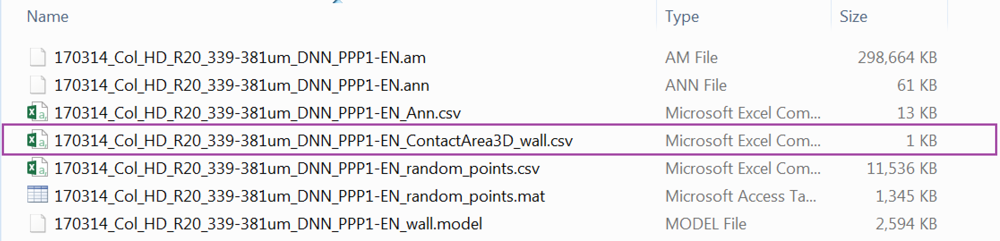

<br>

In this section we continue to ask questions about the distribution of Plasmodesmata (or similar types of annotations along a given model). We continue to use the output of the Spatial control plugin shown in the [Distributions section](#distributions.html). Since we previously detected a bias in the distribution of Plasmodesmata, strongly hinting at the presence of spatial clustering, and we then quantified the number of these clusters of plasmodesmata we now ask: **What proportions of the cellular surface do these clusters occupy?**

<br>

# Exploring the data

```{r, include = FALSE}

# THIS SECTION IS HIDDEN AND ONLY REQUIRED BECAUSE KNITTING TREATS R MARKDOWNS INDEPENDENTLY so it is not possible to call variables present in another markdown

library(tidyverse)
library(broom)

setwd('./Data_individual_cells')
clusters <- read_csv("clusters.csv")

# we also set the general plotting theme
# where we need to deviate from this it is shown in the code

theme_set(
  theme_bw() + 
      theme(axis.title.x = element_text(size = 15), 
        axis.title.y = element_text(size = 15), 
        axis.text.x = element_text(size = 15), 
        axis.text.y = element_text(size = 15),
        strip.text.x = element_text(size = 15), 
        legend.title = element_text(size = 15),
        legend.text = element_text(size = 15))  
)


```

<br>

```{r, message = FALSE, warning= FALSE}

library(tidyverse)
library(broom)
#library(splancs) called in the function so no need to load it
#library(ggbeeswarm) called in the function so no need to load it

# we loook at one one cell as an example
# please note that the clusters object is being carried over from the analysis that was performed in previous sections

cluster_example <- clusters %>% filter(DatasetFilename == "170314_Col_HD_R20_339-381um_DNN" & Cell == "PPP1-EN")

# we are going to largely replicate the workings of the fviz_clust function used in clusters section. There these steps were done implicitly by the functions but here we make the steps apparent and we extract data

# we first perform a pca, reducing our data to a 2D situation
# we scale the data to match what was done by the fviz_clust function. Note that this is not strictly necessary but more for graphical matching purposes. Clusters can be recognised in both cases. The scaling can also be turned off in the fviz_clust command. Either way the scaling effect seems negligible

cluster_pca <- cluster_example %>% select(X_units, Y_units, Z_units) %>% prcomp(scale. = TRUE)

# we can check that the PCA is not causing a signicant loss of information

tidy(cluster_pca, matrix = "pcs") %>% print() 
# more than 90% retained in all cases in the first two dimentions

# we attach the pca columns contained in pca object to the original data
# 1 and 2 only take the first two PCAs, we are not attaching third PCA

cluster_example <- cbind(cluster_example, cluster_pca$x[, 1:2]) %>% 
  # we also order the numbers of clusters for that well so that they will appear in a logical order in the legend 
  mutate(.cluster = factor(.cluster, levels = c("1", "2", "3", "4", "5", "6","7","8", "9", "10", "11"))) %>% 
  mutate(.class = factor(.class, levels = c("1", "2", "3", "4", "5", "6","7","8", "9", "10", "11", "12", "13", "14")))

# we use now use the chull function
# it finds the rows that contain the points (and the coordinates) that describe the edges of the poligon that could be drawn around each cluster
# to isolate those rows we use the function slice
# we group by cluster to obtain the single areas or we don't to obtain the full surface of the cell 

cluster_chull_sil <- cluster_example %>% 
  group_by(.cluster) %>% 
  slice(chull(PC1, PC2))

cluster_chull_class <- cluster_example %>% 
  group_by(.class) %>% 
  slice(chull(PC1, PC2))

total_chull <- cluster_example %>% 
  slice(chull(PC1, PC2))

# we visualise the results, in this case for the silhouette method

ggplot(cluster_example, aes(PC1, PC2)) +
  geom_point(data = cluster_example, aes(colour=.cluster, fill=.cluster)) +
  geom_polygon(data = total_chull, alpha = 0.09) +
  geom_polygon(data = cluster_chull_sil, aes(colour=.cluster, fill = .cluster), alpha = 0.3) +
  xlab("PC1 (78.5%)") + ylab("PC2 (20.5%)") +
  labs(fill = "Silhouette \n clusters", colour = "Silhouette \n clusters")

# you will notice that this is nearly identical to the fviz function results
# by using .class instead you would get the results according to the McLust function

# now we want to calculate areas
# we  created a small function that uses the areapl from the splancs library

cha <- function(x,y){
  i <- chull(x,y)
  return(splancs::areapl(cbind(x[i],y[i])))
}

cluster_example %>% 
  mutate(total_area = cha(PC1, PC2)) %>% 
  group_by(.cluster) %>% 
  summarise(area = cha(PC1, PC2), total_area = unique(total_area)) %>%
  head()

# do note that the units of these values are not strictyly speaking conventional surface units as the coordinates underwent a pca. We address this aspect in following steps

```

<br>

# Compiling the data

<br>

```{r,  message = FALSE, warning= FALSE}

# to process multiple cells in one go we write a larger function encompassing the steps described above 

calculate_areas_sil <- function(x){
  
  # Run PCA
  x_pca <- x %>% 
    select(X_units, Y_units, Z_units) %>% 
    prcomp(scale. = TRUE)
  
  # bind first two PCs
  x <- cbind(x, x_pca$x[, 1:2])
  
  # calculate area of each cluster (here we do it for the silhouette method)
  area_of_clusters <- x %>% 
    group_by(.cluster) %>% 
    summarise(area = cha(PC1, PC2))
  
  # add total area
  area_of_clusters$total_area <- cha(x$PC1, x$PC2)
  
  #add sum of the areas of clusters
  area_of_clusters$sum_area <- sum(area_of_clusters$area)
  
  #percentage conductive surface (of the total)
  area_of_clusters$perc_tot <- area_of_clusters$sum_area/area_of_clusters$total_area*100
  
  #percentage of surface of each cluster 
  area_of_clusters$perc <- area_of_clusters$area/area_of_clusters$total_area*100
  
  return(area_of_clusters)
}

# a nearly identical second function is created for the Mclust method

calculate_areas_class <- function(x){
  
  x_pca <- x %>% 
    select(X_units, Y_units, Z_units) %>% 
    prcomp(scale. = TRUE)
  x <- cbind(x, x_pca$x[, 1:2])
  
  # we use .class instead
  area_of_clusters <- x %>% 
    group_by(.class) %>% 
    summarise(area = cha(PC1, PC2))
  
  area_of_clusters$total_area <- cha(x$PC1, x$PC2)
  
  area_of_clusters$sum_area <- sum(area_of_clusters$area)
  
  area_of_clusters$perc_tot <- area_of_clusters$sum_area/area_of_clusters$total_area*100
  
  area_of_clusters$perc <- area_of_clusters$area/area_of_clusters$total_area*100
  
  return(area_of_clusters)
}

# we apply it and we nest the results

clusters_processed <- clusters %>% 
  group_by(DatasetFilename, Genotype, Interface, Cell) %>% 
  nest() %>% 
  mutate(cluster_sil_areas = lapply(data, calculate_areas_sil)) %>% 
  mutate(cluster_class_areas = lapply(data, calculate_areas_class))

# we then unnest separately the results for either method

area_for_method_sil <- clusters_processed %>% 
  unnest(cluster_sil_areas) %>% 
  mutate(Method = "Silhouette")

area_for_method_class <- clusters_processed %>% 
  unnest(cluster_class_areas) %>% 
  mutate(Method = "Mclust")

# we then merge them

clusters_unnested <- bind_rows(area_for_method_class, area_for_method_sil)

```
<br>

# Calculating the median total conductive surface of an interface (as %)

<br>

```{r}

# we now ask how much of the total surface (the gray shaded area we calculated in previous steps) is occupied by PD clusters

# for plotting you need to isolate the unique value for each cell (otherwise each cluster will be counted as a point altering the shape of distribution).
#the easiest way is to subset the dataset only for relevant columns and then use unique

ggplot(data=unique(clusters_unnested[, c("Genotype", "Interface", "DatasetFilename", "Cell", "perc_tot", "Method")]), aes(x= Method, y=perc_tot, colour= Genotype, fill= Genotype)) +
    # we use shape = to characterise the points according to which root (datset they belong to)
  ggbeeswarm::geom_quasirandom(aes(shape=DatasetFilename,group=Genotype), size= 4, alpha=0.5, width=0.1, show.legend = FALSE, dodge.width = 0.9) +
  stat_summary(fun.y = median, fun.ymin = median, fun.ymax = median,
               geom = "crossbar", size = 0.5, width = 0.3, alpha=1)  + 
  labs(y = "% of interface surface overall occupied by PD clusters") +
  scale_color_manual(values=c("#8B8B83")) +
  scale_fill_manual(values=c("#8B8B83")) +
  facet_grid(~Interface) +
  scale_y_continuous(limits= c(5,40), breaks = c(5,10,15,20,25,30,35,40)) +
  scale_shape_manual(values=c(19,17))

```

<br>

# Calculating the median surface of individual clusters (as %) 

<br>

```{r,  message = FALSE, warning= FALSE}

# to calculate the surface of individual clusters independently we don't need to subset the data

ggplot(clusters_unnested, aes(x= Method, y=perc, colour= Genotype, fill= Genotype)) +
  geom_violin(alpha=0.5)+ 
  ggbeeswarm::geom_quasirandom(aes(group=Genotype), colour="black", fill="black", size= 2, alpha=0.5, width=0.1, show.legend = FALSE, dodge.width = 0.9) +
  stat_summary(fun.y = median, fun.ymin = median, fun.ymax = median,
               geom = "crossbar", size = 0.5, width = 0.3, alpha=1)  + 
  labs(y = "% of interface surface occupied by individual PD clusters") +
  scale_color_manual(values=c("#8B8B83")) +
  scale_fill_manual(values=c("#8B8B83")) +
  facet_grid(~Interface) +
  scale_y_log10()

```

<br>

# Calculating the actual surface of the interface

<br>

In this part we try to relate the percentages we calculated in the [sections above](#surf1) to the real surface areas (in um^2) of our cells. To do this we employ the second plugin developed for the Paterlini, Belevich et al. paper: the *SurfaceArea3D* plugin. An earlier version of the plugin has actually been used in an earlier paper we published [Yan et al.(2019)](https://www.nature.com/articles/s41477-019-0429-5)

<br>

# Run the *SurfaceArea3D* plugin {#run2} 

<br>
Make sure you have loaded your datasets and models as described in the [Preliminary Steps section](preliminary.html). In this case annotations are not required.

From the MIB interface go to the Plugins tab -> Organelle Analysis -> SurfaceArea3D. 
A user interface will appear with multiple fields to be filled in: 

  * For "Material with surface" select the appropriate segmented object you want to calculate the area of. 

  * For "XY smoothing", "XY sampling" and "Z sampling" input values of *5, 5 and 1*. This creates an appropriate level of surface smoothing for the surface we are trying to generate and ensures a good yet computationally feasible sampling of our models to generate the surface itself. This parameter might depend on your object of interest.

  *  Clicking "Export results to Matlab" displays the resulting surface values in Matlab. Clicking "Save results in Matlab, Excel or CSV format" conversely allows you to store these values in a file. By pressing "Filename for export" ensure that the format is *.csv* (this is the format we recommend and used in this analysis) 

  * Clicking "Generate a model for each contact" enables you to store the surface object(s) being generated

  * "Export contact To Imaris" sends the generated surface(s) to Imaris for 3D rendering.

After pressing "Continue", when the process has finished a new window will appear with the largest of surfaces calculated appearing in it.

{width=700}

<br>

# Check outputs 

<br>

If the plugin has worked correctly and you followed the instructions to calculate the surfaces of the models your *Data_individual_cells* folder should now contain one additional files. 

This is the output of the *SurfaceArea3D* plugin: a <i>\*_SurfaceArea3D_wall.csv</i> file. 

In the files one object with a certain surface shoud be listed in most cases. However, please note that in certain cases (such as cases where shifts in the images are present) multiple objects might be detected. This is just because the software can't generate a single objects but rather produces two objects separated by the section where the image shift occurred. Small wall sections can also generate additional smaller objects

<br>
{width=700}

<br>

If you want to analyse multiple datasets at the same, as we will do here, the processes described above need to be repeated for each *.am* file.

<br>

# Processing the surfaces in R

<br>

```{r, message = FALSE, warning= FALSE, results = 'hide'}

# THIS SECTION IS HIDDEN AND ONLY REQUIRED FOR KNITTING PURPOSES
# BECAUSE WE DON'T WANT TO SHOW SETWD FUNCTION (as the path would likely be different on the computer of a user, we mirror the first part of the script and run it in a hidden chunk. The chunk diplayed will actally be idle, showing the code but not run

setwd('./Data_individual_cells')

#first we read the files 
Col_area <- list.files(path = ".", pattern = "SurfaceArea3D_wall.csv") %>%   map_df(function(f){
        #this will print the dataset 
    print(f) 
    x <- read_csv(f) %>% 
      as.data.frame %>% 
      mutate(DatasetFilename = f) %>%
      mutate(Genotype = "Col-0") %>%
      mutate(Interface = "PPP-EN") 
  })    

#we edit the text of the DatasetFilename column to clean it 
Col_area$DatasetFilename <- gsub("_SurfaceArea3D_wall.csv", "", Col_area$DatasetFilename)

```

```{r, eval = FALSE}

# IMPORTANT:
# the working directory is assumed to be the downloaded folder "Data_individual_cells" so paths are given relative to that. Make sure this is also the case in your R environment using the getwd and setwd

#first we read the files 
Col_area <- list.files(path = ".", pattern = "SurfaceArea3D_wall.csv") %>%   
  map_df(function(f){
        #this will print the dataset 
    print(f) 
    x <- read_csv(f) %>% 
      as.data.frame %>% 
      mutate(DatasetFilename = f) %>%
      mutate(Genotype = "Col-0") %>%
      mutate(Interface = "PPP-EN") 
  })    

#we edit the text of the DatasetFilename column to clean it 
Col_area$DatasetFilename <- gsub("_SurfaceArea3D_wall.csv", "", Col_area$DatasetFilename)

```

```{r, message = FALSE, warning= FALSE}

# because in some cases multiple objects were generated (despite having a single cellular interface) we merge those multiple objects into a single one
Col_area_corrected <- Col_area %>% group_by(Genotype, Interface, DatasetFilename) %>% dplyr::summarise(total_surface = sum(SurfaceArea, na.rm = TRUE))

# we are going to clean the DatasetFilename column as we did elsewhere in this pipeline
# we are going to duplicate the dataset column first 
Col_area_corrected$Cell = Col_area_corrected$DatasetFilename

#in the dataset filename column we remove anything after _DNN
Col_area_corrected$DatasetFilename <- gsub("_PPP.*","", Col_area_corrected$DatasetFilename)

# in the column cell we remove anything before the name of the cell
Col_area_corrected$Cell <- gsub(".*PPP", "PPP", Col_area_corrected$Cell)

# we plot it
Col_area_corrected %>%
  ggplot(aes(x= Genotype, y=total_surface, colour= Genotype, fill= Genotype)) +
  stat_summary(fun.y = median, fun.ymin = median, fun.ymax = median,
               geom = "crossbar", size = 0.5, width = 0.3, alpha=1)  + 
  ggbeeswarm::geom_quasirandom(aes(shape=DatasetFilename), size= 4, alpha=0.5, width=0.1, show.legend = FALSE, dodge.width = 0.3) +
  labs(y = "Surface area of the cell (um^2)") +
  theme(legend.position = "none") +
  scale_color_manual(values=c("#8B8B83")) +
  scale_fill_manual(values=c("#8B8B83")) +
  facet_grid(~Interface) +
  scale_y_continuous(limits= c(60,130), breaks = c(60,70,80,90,100,110,120,130,140)) +
  scale_shape_manual(values=c(19,17))

```

<br>

Using the median value of the surface and the median values of the percentages that we obtained [above](#surf1) we can manually get estimates in um^2 of the conductive surface in cells and of the surface of the single clusters.

<br>

You have now completed this section: we have calculated the surfaces occupied by the clusters on our interfaces of interest. In the [next section](wall.html) we will ask questions about the wall environment plasmodesmata lie within.