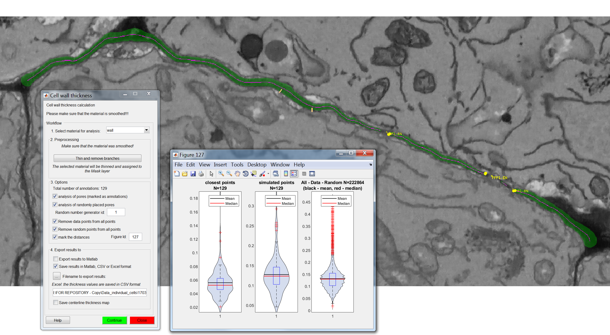
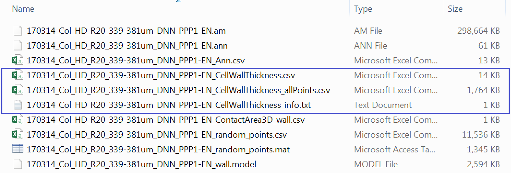

<!-- Load Zooming library that will enable to click on images and zoom them -->
<script src="https://unpkg.com/zooming/build/zooming.min.js"></script>

<script>
// Listen to images after DOM content is fully loaded
document.addEventListener('DOMContentLoaded', function () {
new Zooming({
// options...
}).listen('.img-zoomable')
})
</script>

<br>

In this section we shift to a different biological question and we employ the last plugin developed for the Paterlini, Belevich et al. paper. Using the *CellWallThickness* plugin we will try to address the biological question of cell wall thickness around Plasmodesmata (or similar types of annotations along a given model). We ask: **Is the cell wall in proximity of plasmodesmata different (in terms of thickness) compared to the wall average?**

<br>

# Run the *CellWallThickness* plugin {#run3} 

<br>

The plugin is fed a segmented wall and finds its centerline. A distance map, which assigns a value to each model pixel based on its distance to the closest edge of the model, is calculated at each slice. The values at each point of the masked centerline are then obtained by placing the centerline over the distance map image. See the methods section of the paper for more detail.

Make sure you have loaded your datasets, models and annotations as described in in the [Preliminary Steps section](preliminary.html).  

From the MIB interface go to the *Plugins* tab -> *Plasmodesmata* -> *CellWallThickness*. A user interface will appear with fields to be filled in.

  * "Select material for analysis" requires you to choose the correct segmented object for analysis 
  * *Thin and remove branches* button within the pre-processing box generates a midline of the model (in presence of branching points, keeps the longest branch) and temporarily stores it in the Mask layer of the *.model* file. For more details please see the paper. 

A series of options are available for the analysis:

  * Selecting "Analysis of pores" calculates the cell wall thickness in proximity of the plasmodesmata (or any other provided annotation), in addition to measuring the wall thickness at all positions on the midline of the model. 
  * Selecting "Analysis of randomly placed pores" calculates the cell wall thickness at control points (uniformly distributed over the same provided model) equal in number to the annotations provided. "Random number generator id" enables to reproduce results for the controls (generating the same random distributions for that particular model). The same id number needs to be used for such purpose. Every time you will run the plugin - on the same dataset - with that number you will obtain the same control points.
  * In order to make the data classes (real or "closest" points, the random "simulated" points, and "all points") independent, you need to press "Remove data points from all points" and "Remove random points from all points". This ensures that no point from those classes will be included in the other class.   * "Mark the distances" displays on the model the distance vectors that are being measured (at plasmodesmata and control positions). 

Note: if you were to compare the overall cell wall thickness between interfaces (as performed in the paper) you would need to leave all boxes from the option section unclicked.

  * Clicking "Export results to Matlab" displays the resulting values in Matlab. Clicking "Save results in Matlab, Excel or CSV format" conversely allows you to store these values in a file. 
  * "Save centerline thickness map" enables you to save the thinned model as an image, which can then be imported into rendering software.

<!-- all figures need to be placed in this syntax to be zoomable -->

<figure></figure>

<br>

After pressing "Continue", when the process has finished a new window will appear with visual plots of the wall thickness values for the various categories being requested.

<br>

# Check outputs

<br>

If the plugin has worked correctly and you followed the instructions to calculate the thicknesses at the positions of interest in the models your Data_individual_cells folder should now contain three additional files.

One is <i>\*_CellWallThickness_info.txt</i> which is a text document containing info on the datasets. We won't use this file. There is a <i>\*_CellWallThickness.csv</i> file which contains the cell wall thicknesses at real and at an equal number of uniformly distributed control points. The third file <i>\*_CellWallThickness_allPoints.csv</i> contains the cell wall thickness at every single point at the midline of our cell wall model.

<br>

<figure></figure>

<br>

If you want to analyse multiple datasets at the same, as we will do here, the processes described above need to be repeated for each *.am* file.

<br>

# Processing the thicknesses in R

<br>

```{r, include= FALSE}

# THIS SECTION IS HIDDEN AND ONLY REQUIRED FOR KNITTING PURPOSES
# BECAUSE WE DON'T WANT TO SHOW SETWD FUNCTION (as the path would likely be different on the computer of a user, we mirror the first part of the script and run it in a hidden chunk. The chunk diplayed will actally be idle, showing the code but not run

library(tidyverse)

setwd('./Data_individual_cells')

Col_allwall <- list.files(path = ".", pattern = "CellWallThickness_allPoints.csv") %>%   map_df(function(f){
    x <- read.csv(f) %>% 
      as.data.frame %>% 
      mutate(DatasetFilename = f) %>%
      mutate(Genotype = "Col-0") %>%
      mutate(Interface = "PPP-EN") %>%
      mutate(Positions = "All others")
  })    

Col_allwall$DatasetFilename <- gsub("_CellWallThickness_allPoints.csv", "", Col_allwall$DatasetFilename)

Col_allwall <- Col_allwall %>% rename('Thickness_um'='Matrix.of.cell.wall.thickness.values.in.micrometers.for.each.point.of.the.masked.centreline')

Col_wall <- list.files(path = ".", pattern = "CellWallThickness.csv") %>%   map_df(function(f){
    x <- read.csv(f) %>% 
      as.data.frame %>% 
      mutate(DatasetFilename = f) %>%
      mutate(Genotype = "Col-0") %>%
      mutate(Interface = "PPP-EN")
  })    

Col_wall$DatasetFilename <- gsub("_CellWallThickness.csv", "", Col_wall$DatasetFilename)

Col_wall_pd <- select(Col_wall, "Genotype", "Interface", "DatasetFilename", "WallThicknessRealPores_um") %>%
  rename('Thickness_um'='WallThicknessRealPores_um') %>%
  mutate(Positions = "PDs")

Col_wall_sim <- select(Col_wall, "Genotype", "Interface", "DatasetFilename", "WallThicknessRandomPores_um") %>% 
  rename('Thickness_um'='WallThicknessRandomPores_um') %>%
  mutate(Positions = "Rand. Unif. distributed")

# we also set the general plotting theme
# where we need to deviate from this it is shown in the code

theme_set(
  theme_bw() + 
      theme(axis.title.x = element_text(size = 15), 
        axis.title.y = element_text(size = 15), 
        axis.text.x = element_text(size = 15), 
        axis.text.y = element_text(size = 15),
        strip.text.x = element_text(size = 15), 
        legend.title = element_text(size = 15),
        legend.text = element_text(size = 15))  
)

```

```{r, eval=FALSE}
library(tidyverse)
#library(ggbeeswarm) called in the function so no need to load it

# IMPORTANT:
# the working directory is assumed to be the downloaded folder "Data_individual_cells" so paths are given relative to that. Make sure this is also the case in your R environment using the getwd and setwd

#first we can read the files containing all the points (or all other points depending on which options were selected)
Col_allwall <- list.files(path = ".", pattern = "CellWallThickness_allPoints.csv") %>%   map_df(function(f){
    x <- read.csv(f) %>% 
      as.data.frame %>% 
      mutate(DatasetFilename = f) %>%
      mutate(Genotype = "Col-0") %>%
      mutate(Interface = "PPP-EN") %>%
      mutate(Positions = "All others")
  })    

#we edit the text of the DatasetFilename column to clean it 
Col_allwall$DatasetFilename <- gsub("_CellWallThickness_allPoints.csv", "", Col_allwall$DatasetFilename)

# we rename the thickness column 
Col_allwall <- Col_allwall %>% rename('Thickness_um'='Matrix.of.cell.wall.thickness.values.in.micrometers.for.each.point.of.the.masked.centreline')

# now we read the files containing thicknesses at real and control points
Col_wall <- list.files(path = ".", pattern = "CellWallThickness.csv") %>%   
  map_df(function(f){
    x <- read.csv(f) %>% 
      as.data.frame %>% 
      mutate(DatasetFilename = f) %>%
      mutate(Genotype = "Col-0") %>%
      mutate(Interface = "PPP-EN")
  })    

#we edit the text of the DatasetFilename column to clean it 
Col_wall$DatasetFilename <- gsub("_CellWallThickness.csv", "", Col_wall$DatasetFilename)

# we select the data relating to Pd positions (real) 

Col_wall_pd <- select(Col_wall, "Genotype", "Interface", "DatasetFilename", "WallThicknessRealPores_um") %>%
  # we rename the thickness column so that it will match with the one from all points
  rename('Thickness_um'='WallThicknessRealPores_um') %>%
  # we create a column describing the type of data
  mutate(Positions = "PDs")

# we do the same for simulated points

Col_wall_sim <- select(Col_wall, "Genotype", "Interface", "DatasetFilename", "WallThicknessRandomPores_um") %>% 
  rename('Thickness_um'='WallThicknessRandomPores_um') %>%
  mutate(Positions = "Rand. Unif. distributed")
```

```{r, message = FALSE, warning= FALSE}
# we merge the two objects

Col_0 <- rbind(Col_wall_pd, Col_wall_sim, Col_allwall)

# we create a new column with the wall thickness in nm (a better unit for this biological scale) and we also impose an order on the Position classes for visual purposes

Col_0 <- Col_0 %>%
  mutate("Thickness_nm" = Thickness_um*1000) %>%  
  mutate(Positions = factor(Positions, levels = c("PDs", "Rand. Unif. distributed", "All others")))

#we are now going to separate the dataset file name in two columns, one containing info on the root and one containing info on the actual cell
# we are going to duplicate the dataset column first
Col_0$Cell = Col_0$DatasetFilename

#in the dataset filename column we remove anything after _DNN
Col_0$DatasetFilename <- gsub("_PPP.*","", Col_0$DatasetFilename)

# in the column cell we remove anything before the name of the cell
Col_0$Cell <- gsub(".*PPP", "PPP", Col_0$Cell)

# PLOT VALUES FOR ONE CELL

ggplot(data=filter(Col_0, DatasetFilename=="170314_Col_HD_R20_339-381um_DNN" & Cell=="PPP1-EN"), aes(x = Positions, y = Thickness_nm, fill=Positions, colour=Positions)) +  geom_violin(alpha=0.25) + theme_bw() +
  stat_summary(fun.y = median, fun.ymin = median, fun.ymax = median, geom = "crossbar", size = 0.3, width = 0.4, alpha=1) +
  labs(x = "Positions", y = "Wall thickness (nm)") + 
  theme(legend.position = "none")  +
  # the log scale is useful here because of the range of values
  scale_y_log10() + 
  facet_wrap(DatasetFilename~Cell)

# PLOT VALUES FOR MULTIPLE CELLS (and multiple genotypes)

# we summarise the values of thickness for each cell
stats <- Col_0 %>% 
  group_by(Genotype, Interface, DatasetFilename, Cell, Positions) %>% 
  dplyr::summarise(mean_thickness = mean(Thickness_nm))

# we drop the violins from the plot

# we introduce a dodge graphical parameter to better space the groups
dodge <- position_dodge(width = 0.4)

ggplot(data=stats, aes(x = Positions, y = mean_thickness, fill=Genotype, colour=Genotype, group = factor(Genotype))) + theme_bw() +
  stat_summary(fun.y = median, fun.ymin = median, fun.ymax = median,
               geom = "crossbar", size = 0.4, width = 0.5, alpha=1, position = dodge) +
  # we differentiate the roots (datasets) via different shapes
  ggbeeswarm::geom_quasirandom(aes(shape=DatasetFilename, fill=Genotype, colour=Genotype), width = 0.2, size= 2, alpha=0.5, dodge.width = 0.8, show.legend = FALSE) +
  labs(x = "Positions", y = "Wall thickness (nm)") +
  facet_grid(~Interface) +
  # here the manual scales are a bit redundant but useful when multiple genotypes present
  scale_color_manual(values=c("#000000")) +
  scale_fill_manual(values=c("#000000")) +
  scale_y_continuous(limits = c(20,180)) +
  scale_shape_manual(values=c(19,17))

```

We have reached the end of this guided pipeline. We hope you will employ the tools we developed for the Plasmodesmata community. Please feel free to share feedback! 

Good luck with your research!
